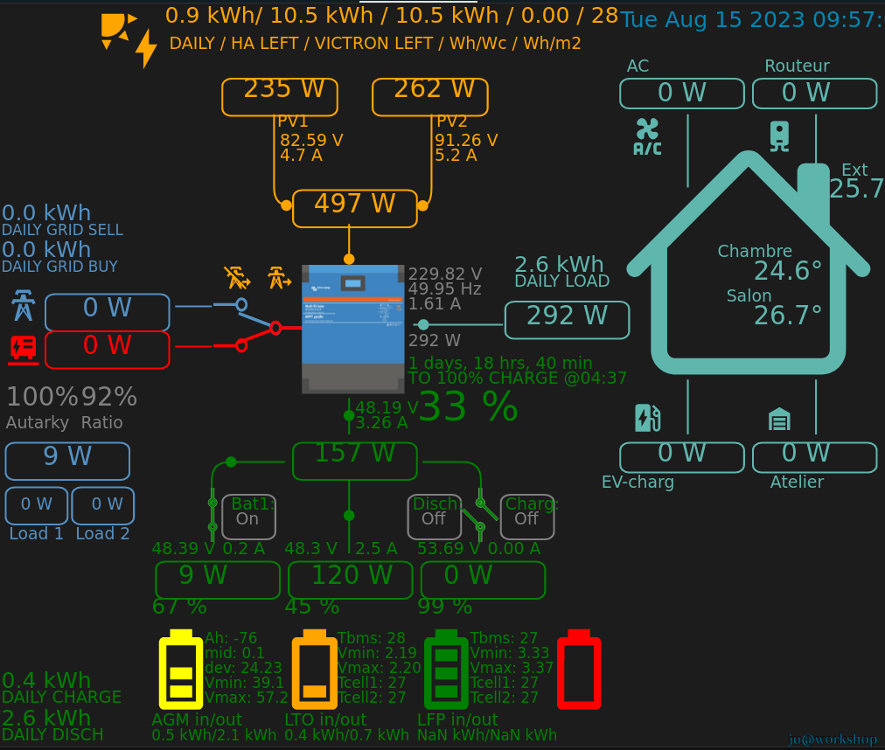
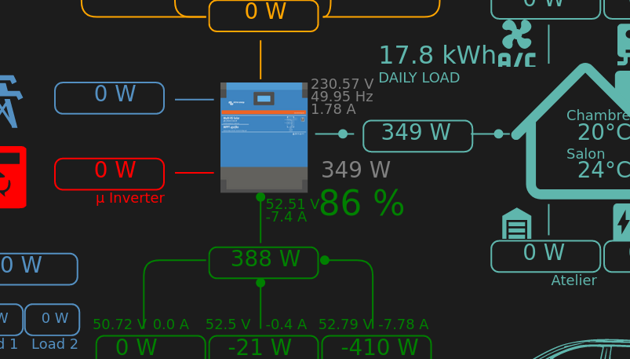
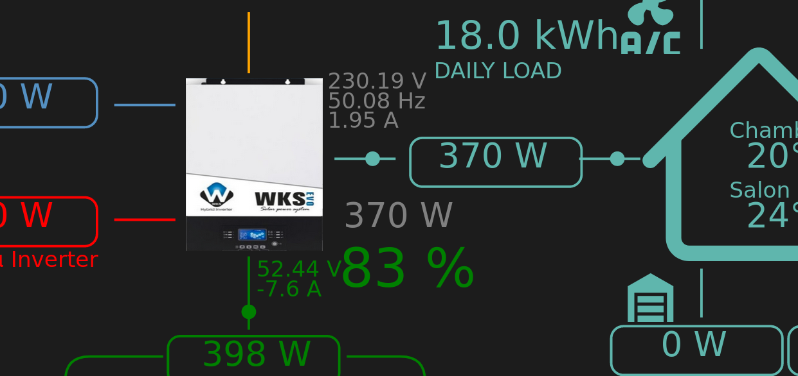
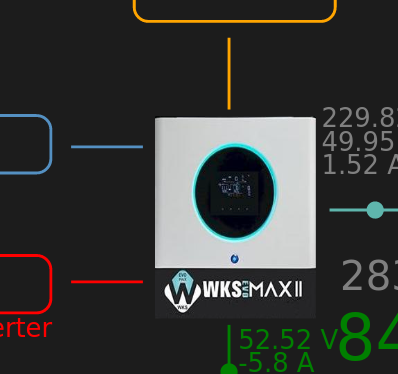

Work in progress...

### Pictures
 
 
In conf card:
 
inverter:
  modern: multi_rs
 .
 
inverter:
  modern: wks
 

inverter:
  modern: wks_max
 

### Video
 

## Usefull links
Many thanks. @slipx06:
. https://github.com/slipx06/sunsynk-power-flow-card

## Donate

If you would like to support this project, you can make a donation using PayPal. Thank you!

